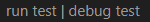

# Gofr Project

This is a simple RESTful API Go project that uses Gofr framework and provides the CRUD operations for managing a hospital.

## Getting Started

These instructions will help you to clone the repository of the project up and running on your host machine for development and testing purposes.

### Prerequisites

You need to have Go installed on your machine. You can download it from the [official website](https://golang.org/dl/).
You need to have Docker Desktop installed on your machine.

### Installing

To install the project, follow these steps:

1. Clone the repository: git clone (https://github.com/arpit2k2gen/hospi.git)
2. Navigate to the project directory: cd gofr
3. Initailize the project by command `go mod init gofr`.
4. Run the command `go mod tidy`.
5. Two files `go.sum` and `go.mod` would be created.
3. Download the dependencies: `go get .`
4. Run the following commands in a terminal to create a table in MySQL docker image
   - `docker run --name gofr-mysql -e MYSQL_ROOT_PASSWORD=root123 -e MYSQL_DATABASE=hospi -p 3306:3306 -d mysql:8.0.30`
   - `docker exec -it gofr-mysql mysql -uroot -proot123 hospi -e "CREATE TABLE CREATE TABLE Patients (PatientID INT AUTO_INCREMENT PRIMARY KEY,`
      `Name VARCHAR(255) NOT NULL, Gender VARCHAR(10) NOT NULL,RoomNumber INT NOT NULL, Diagnosis VARCHAR(255) NOT NULL);`

## Running the tests

To run the tests, use the following command: `go test .`
or simply click on 

just above the test code in `main_test.go`

## Running the application

To start the application, use the following command: `go run .` or `go run main.go`

The application will start and listen on port 8000.

## API Endpoints
- `GET/patient/{id}`: Get a details of the patient by id.
- `POST/patient`: Create the details of new patient.
- `PUT/patient/{id}`: Update the details of a patient from the list.
- `DELETE/patient/{id}`: Delete the details for a patient.

## Built With

- [Go](https://golang.org/) - The programming language used.
- [Gofr](https://gofr.dev/) - The framework used.

## Authors

- Arpit Kaushal - Developer - [arpit2k2gen](https://github.com/arpit2k2gen)

